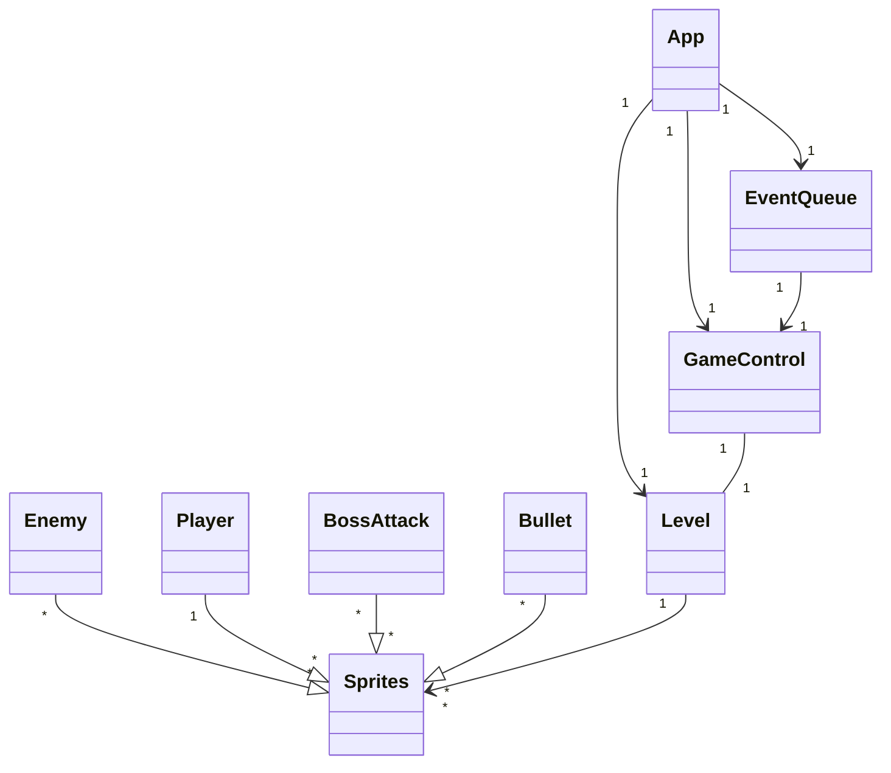
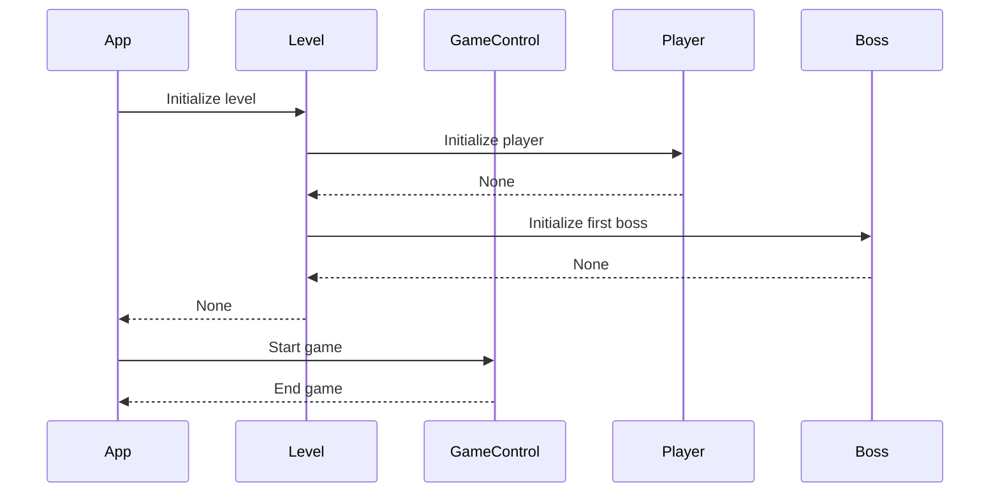

# Arkkitehtuurikuvaus

## Pelin logiikka

## Pelin kulku
Ohjelman toimiminen, siitä asti kun pelaaja syöttää komennon poetry run invoke start, siihen asti kun pelaaja sulkee ohjelman:
Kun pelaaja suorittaa tämän komennon, app tiedosto alustaa Level luokan, joka taas alustaa pelaajan ja ensimmäisen päävihollisen. Tätä level luokkaa käytetään parametrina app tiedoston alustaessa GameControl luokan. App tämän jälkeen kutsuu GameControl main_menu funktiota, jolloin peli lähtee käyntiin. Peli on käynnissä kunnes pelaaja sulkee sen.

## Tiedostojen tallennus ja luku:
Kun pelaaja häviää pelin, sovellus tallentaa tiedon saavutetusta tasosta SQLite-tietokantaan.

Pelaajan paras saavutettu taso luetaan pelaajalle pelin alkuruudussa.

### Tiedostot

Peli tallentaa tiedot konfiguraatiotiedosto .env määrittelemään tietokantatiedostoon.

