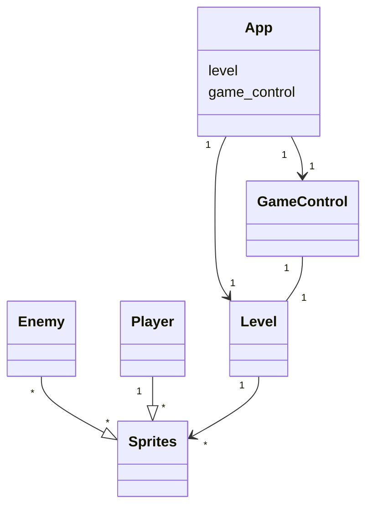

```mermaid
    classDiagram
        App "1" --> "1" GameControl
        App "1" --> "1" Level
        GameControl "1" -- "1" Level
        Enemy "*" --|> "*" Sprites
        Player "1" --|> "*" Sprites
        Level "1" --> "*" Sprites
        class App{
            level
            game_control
        }
        class GameControl{

        }
        class Level{

        }
        class Sprites{

        }
        class Enemy{

        }
        class Player{
            
        }
```