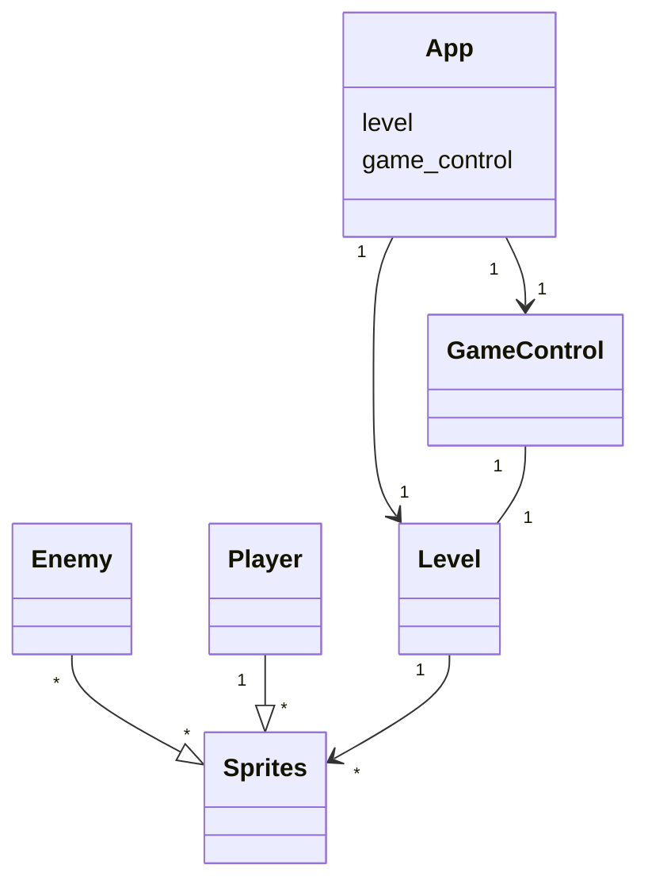
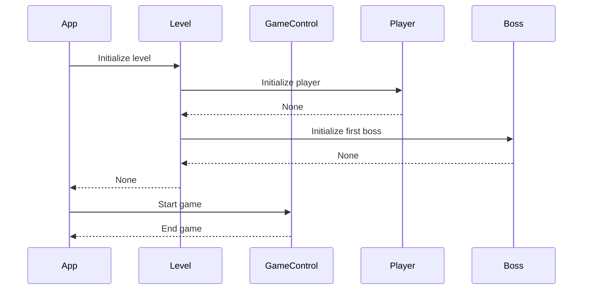

# Arkkitehtuurikuvaus

## Pelin kulku

## Tiedostojen tallennus ja luku:
Kun pelaaja häviää pelin, sovellus tallentaa tiedon saavutetusta tasosta SQLite-tietokantaan.

Tämä tieto luetaan pelaajalle pelin alkuruudussa.

### Tiedostot

Peli tallentaa tiedot konfiguraatiotiedosto .env määrittelemään tietokantatiedostoon.

