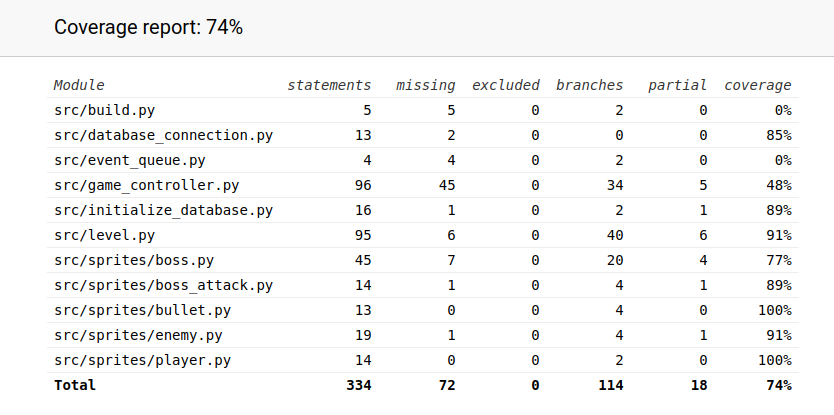

# Testausdokumentti

Peliä on testattu automaattisillä unittest testeillä, sekä myös manuaalisesti etsitty bugeja.

### Testauskattavuus
Testikattavuus on korkea, mutta GameControl luokan testaus jäi vähäiseen, luokan testauksen vaikeuden takia.

Pelin haarautumakattavuus on 74 %:

### Sovellukseen jääneet ongelmat

- Käyttäjä voi liikkuttaa hiirtänsä pause-ruudussa, joten pelaajan ohjaama objekti liikkuu uuteen hiiren paikkaan peliä jatkettaessa

- Peliä ei voi aloittaa uudestaan loppuruudusta, vaan pitää ensiksi palata alkuruutuun, ja sitten aloittaa uusipeli

- Pelaaja voi liikuttaa peliobjektinsa puoliksi ulos ruudusta
