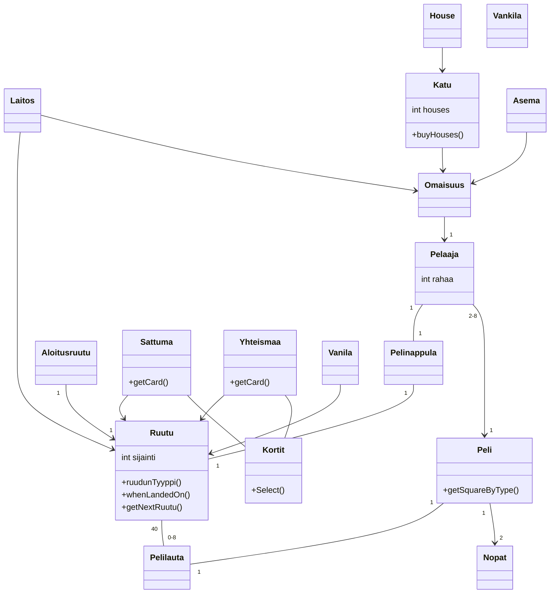

```mermaid
    classDiagram
        Pelaaja "1" -- "1" Pelinappula
        Ruutu "40" -- "0-8" Pelilauta 
        Pelinappula "1" -- "1" Ruutu
        Pelaaja "2-8" --> "1" Peli
        Peli "1" -- "1" Pelilauta
        Peli "1" --> "2" Nopat
        Aloitusruutu "1" --> "1" Ruutu
        Laitos --> Ruutu
        Sattuma --> Ruutu
        Yhteismaa --> Ruutu
        Vanila --> Ruutu
        Sattuma -- Kortit
        Yhteismaa -- Kortit
        Katu --> Omaisuus
        Laitos --> Omaisuus
        Asema --> Omaisuus
        House --> Katu
        Omaisuus --> "1" Pelaaja
        


        class Peli{
            +getSquareByType()
        }
        class Nopat{
            
        }
        class Pelaaja{
            int rahaa
        }
        class Pelinappula{

        }
        class Pelilauta{
            
        }
        class Ruutu{
            int sijainti
            +ruudunTyyppi()
            +whenLandedOn()
            +getNextRuutu()
        }
        class Aloitusruutu{

        }
        class Laitos{

        }
        class Vankila{

        }
        class Katu{
            int houses
            +buyHouses()
        }
        class Asema{

        }
        class House{

        }
        class Sattuma{
            +getCard()
        }
        class Yhteismaa{
            +getCard()
        }

        class Kortit{
            +Select()
        }
        
        class Omaisuus{

        }

```     